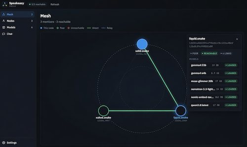
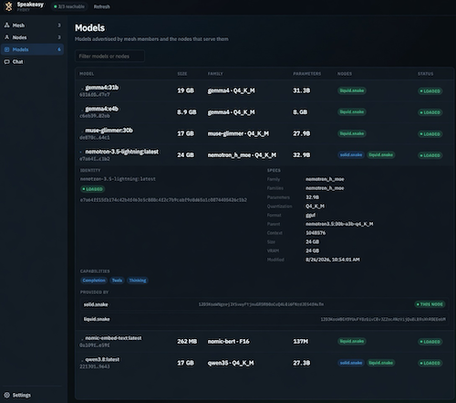

# Speakeasy

Share local Ollama models with a private group over a libp2p mesh, behind one OpenAI- and Ollama-compatible HTTP endpoint.

Speakeasy is a Go proxy for people who already run Ollama and want friends’ machines to see those models without exposing Ollama itself. Each node keeps its own weights. A small admin/relay service tracks membership and helps with NAT. Chat and generate requests hit the local proxy first; if the model is not loaded here, the proxy forwards over the mesh.

## Screenshots

 



The Mesh panel draws members and how they are connected (direct vs relay). Clicking a node opens a side card of models on that peer. The Models panel lists every advertised model, which nodes serve it, and expand-in-place details (identity, specs, capabilities, providers).

## Key features

- **Local-first routing** — `/api/chat`, `/api/generate`, `/api/embed`, `/v1/chat/completions`, `/v1/embeddings`, and `/v1/messages` prefer a local Ollama provider, then a mesh peer that listed the model.
- **Pinned export** — with `model_discovery: pinned`, only currently loaded Ollama models are advertised, so idle weights are not pulled across the mesh.
- **Multiple Ollama backends** — one proxy can export several Ollama instances by listing more than one entry under `providers`.
- **Private mesh** — libp2p Circuit Relay v2, hole punching, and optional LAN mDNS. Application traffic is not hairpinned through the admin HTTP API.
- **Admin ACL** — token/`Bearer` auth on the controller; `allow.list` plus authorize/register for member peer IDs.
- **Dashboard** — `/ui/` with Mesh, Nodes, Models, Chat, and Settings. Chat is in-memory only and warns when a model is served by another node.
- **CLI setup** — `mesh init` and `mesh join` are interactive [huh](https://github.com/charmbracelet/huh) forms. `init` writes `config.example.yaml`, `node.key`, and `relay.key`. `join` only updates `admin_address` and `admin_secret`.

## How it works

1. One host runs **admin** (HTTP membership API + circuit relay). It must be public or port-forwarded (TCP on the admin port, TCP+UDP on the relay port).
2. Each member runs **`mesh init`**, then **`mesh join`** (or fills `admin_address` / `admin_secret` by hand), then **`mesh proxy`** next to a local Ollama.
3. The proxy registers with admin, learns relay multiaddrs, and publishes its exported models. Peers fetch each other’s model lists over libp2p streams (`/.mesh/*`).
4. Clients (Ollama CLI, OpenAI SDKs, or the built-in Chat UI) talk only to the local proxy listen address.

`mesh proxy+admin` (also `hybrid` / `standalone`) runs admin, relay, and proxy on one machine.

## Tech stack

- Go 1.27 (`go.mod`)
- [libp2p](https://github.com/libp2p/go-libp2p) v0.49 (QUIC + circuit relay)
- [Ollama](https://github.com/ollama/ollama) HTTP API
- Standard `net/http` for the admin server and the proxy
- [huh v2](https://pkg.go.dev/charm.land/huh/v2) for `init` / `join`
- Static UI in `web/` (HTML/CSS/JS, no bundler)

There is no required environment variable for the proxy. Config is `config.example.yaml` in the process working directory.

## Prerequisites

- Go 1.27+
- [Ollama](https://ollama.com) on any node that should serve models (default `http://localhost:11434`)
- For an admin/relay: a reachable public IP, or NAT forwarding of **TCP** `admin_port` (default 4002) and **TCP+UDP** `relay_port` (default 4001)

## Quick start

From the repo root (so `config.example.yaml` and `web/` resolve):

```bash
go mod download

make build

# First machine (or any new checkout)
/build/mesh init

# Join an existing mesh (prompts for admin URL + secret, updates config.yaml)
/build/mesh join

# Member: proxy local Ollama onto the mesh
/build/mesh proxy

# Public host: membership API + circuit relay
/build/mesh admin

# Single host: admin + relay + proxy
/build/mesh hybrid
```

Makefile equivalents: `make run-proxy`, `make run-admin`, `make run-hybrid`.

On first run, `node.key` (proxy identity) and/or `relay.key` (admin identity) are created if missing. Keep them.

Open the dashboard at `http://127.0.0.1:<listen>/ui/` (`listen` comes from `config.example.yaml`; the code default is `:8080` if unset).

Optional: set `ACCESSIBLE=1` for huh’s screen-reader prompts during `init` / `join`.

## Configuration

All runtime settings are in `./config.yaml`. `mesh init` writes a commented file. Fields that matter:

```yaml
proxy:
  listen: ":8080"          # local Ollama/OpenAI proxy + UI
  allow_private_backends: true  # required for local Ollama at 127.0.0.1

mesh:
  name: ""                 # empty → hostname
  admin_address: "http://127.0.0.1:4002"
  admin_secret: "<shared-secret>"
  admin_port: 4002
  relay_port: 4001
  public_address: "auto"   # or a concrete IP when behind NAT
  app_port: 0              # 0 for proxy-only
  force_private: false
  mdns_enabled: true

providers:
  - id: localhost
    type: ollama           # only ollama is implemented
    base_url: "http://localhost:11434"
    model_discovery: pinned   # all | pinned | whitelist
    models: []
```

A single proxy can front more than one Ollama process: add another `providers` item with its own `id` and `base_url`. Models from every provider are merged into this node’s advertised set.

`allow.list` (optional, same directory as the admin DB, or `ADMIN_ALLOW_PATH`) is extra peer IDs, one per line.

Do not commit a live `admin_secret`. Examples live under `examples/`.

## Usage

Point existing tools at the proxy listen address.

```bash
export OLLAMA_HOST=http://127.0.0.1:8080
ollama run llama3.2 "hello from the mesh"
```

```python
from openai import OpenAI
client = OpenAI(base_url="http://127.0.0.1:8080/v1", api_key="unused")
print(client.chat.completions.create(
    model="llama3.2",
    messages=[{"role": "user", "content": "hello"}],
))
```

`tests/test-request.sh` curls `/api/ps` and `/api/chat`.

UI JSON (for the dashboard, not for peers):

- `GET /api/mesh/members`
- `GET /api/mesh/models`
- `GET /api/mesh/config`

Peer-only RPC: `GET /.mesh/status`, `/.mesh/members`, `/.mesh/models`.

Admin API (secret via `token` header or `Authorization: Bearer`):

| Method | Path | Purpose |
| --- | --- | --- |
| `GET` | `/api/v1/relay` | Relay multiaddrs + membership clock |
| `POST` | `/api/v1/authorize` | Allow a peer ID |
| `POST` | `/api/v1/nodes` | Register |
| `POST` | `/api/v1/nodes/{id}` | Refresh registration |
| `DELETE` | `/api/v1/nodes/{id}` | Unregister |
| `GET` | `/api/v1/nodes` | List members |

## Project structure

```
cmd/mesh/          # init, join, proxy, admin, hybrid
pkg/proxy/         # HTTP proxy, UI handlers, Ollama/OpenAI routes
pkg/mesh/          # libp2p host, relay, discovery, streams
pkg/admin/         # membership API + ACL
pkg/core/          # config.yaml types
web/               # dashboard
docs/              # screenshots
examples/          # sample YAML
```

## Development

```bash
go test ./pkg/admin/ ./pkg/proxy/ ./pkg/log/
go build -o /tmp/mesh ./cmd/mesh
make build    # linux/darwin/windows binaries under build/
```

Run the binary from a directory that contains `config.example.yaml` and, for the dashboard, `web/`.

This project was built with AI coding tools (the dashboard under `web/` in particular). AI-generated contributions are welcome if a human has reviewed and vetted them before they land.

## License

MIT. See [LICENSE](LICENSE).
