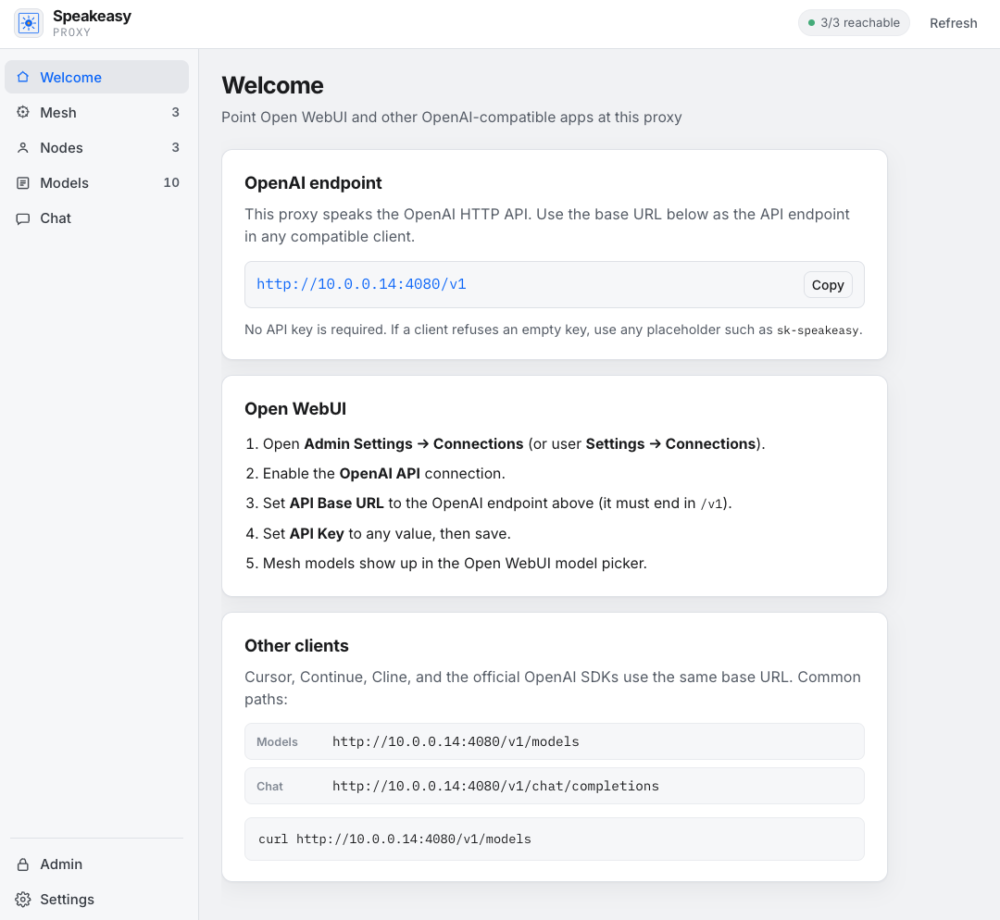
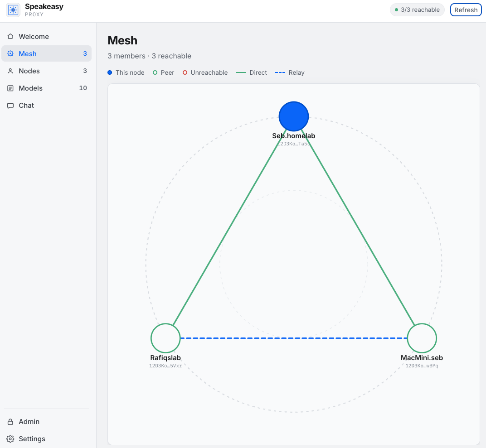
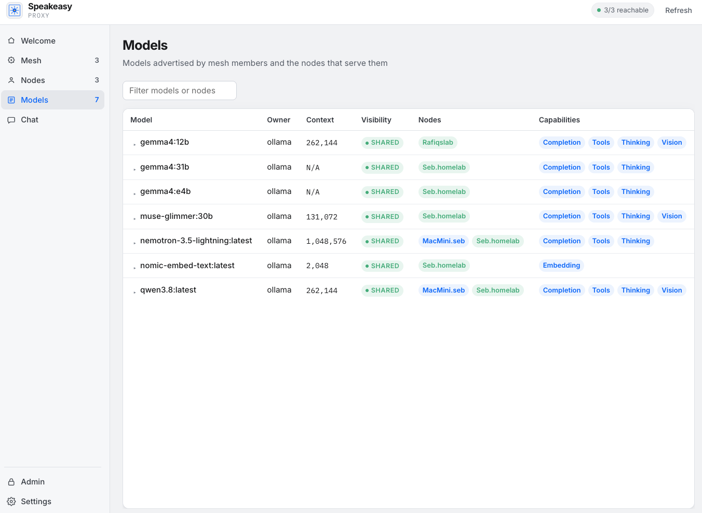
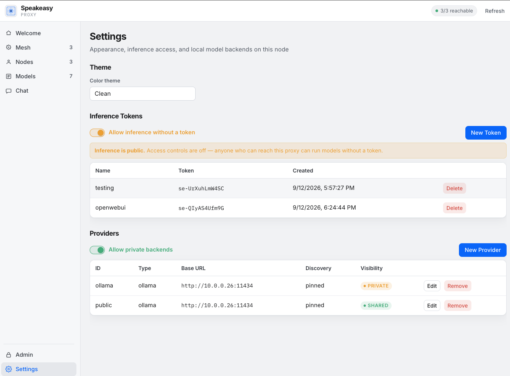
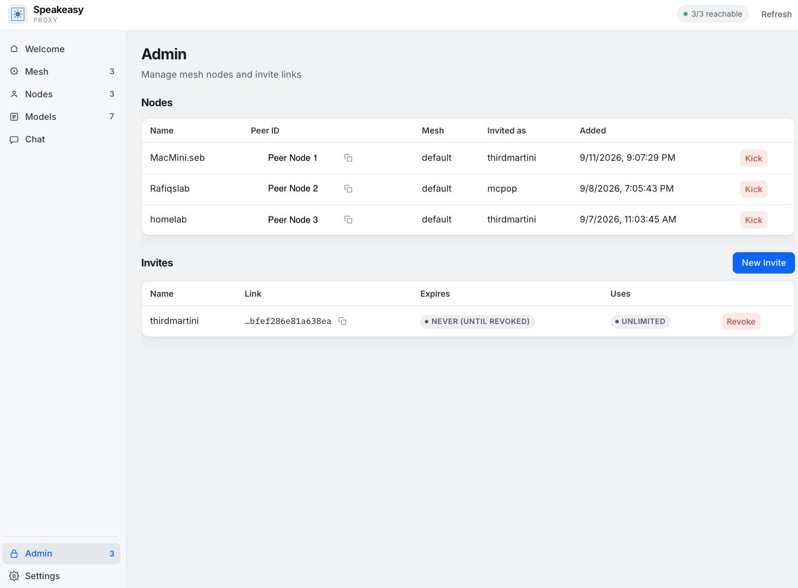

<h1 align="center">
  <a href="https://asynchronomatic.com/"></a>
</h1>
<h3 align="center">A private club for local inference.</h3>


# Table of Contents <!-- omit in toc -->
- [Background](#background)
- [Screenshots](#screenshots)
- [Overview](#overview)
- [Quick Start](#quick-start)
- [Development](#development)


# Background
Speakeasy is an inference proxy, written in Go, for people who already run Ollama/vLLM/etc and want to share their models with a trusted group of friends. 
It started as a project to share my Sparks and GPUs with a few friends without exposing my ollama instances to the internet at large. Over time they too got 
their own hardware to run local inference, and with speakeasy we chare all of that compute and model diversity with each other.

Speakeasy creates a private p2p mesh ([libp2p](https://github.com/libp2p/go-libp2p)) where each node can proxy local models into the mesh.  
Any other member node can then use the models exported into the mesh as inference targets. An inference (OpenAI/Ollama chat) request hits the 
local proxy first; if the model is not loaded here, the proxy forwards over the mesh to one that does.

All traffic is always Peer-2-Peer and encrypted over libp2p QUIC protocol implementation.  The relay (circuit) path is only used to facilitate setup and hole-punching, no data/requests are ever sent via the relay.     

# Screenshots
<div style="display: flex; overflow-x: auto; gap: 12px; max-width: 100%; white-space: nowrap; padding-bottom: 10px;">
  
  
  
  
  
</div>

# Overview

### Key features

- **Local-first routing** — `/api/chat`,  `/v1/chat/completions`, `/v1/embeddings`, and `/v1/messages` prefer a local inference provider, then a mesh peer that listed the model.
- **Pinned export** — with `model_discovery: pinned`, only currently loaded Ollama models are advertised, so idle weights are not pulled across the mesh.
- **Multiple Ollama backends** — one proxy can export several Ollama instances by listing more than one entry under `providers`.
- **Private mesh** — libp2p Circuit Relay v2, hole punching, and optional LAN mDNS. Application traffic is not hairpinned through the admin HTTP API.
- **Admin ACL** — token/`Bearer` auth on the controller
- **Dashboard** — `/ui/` with Mesh, Nodes, Models, Chat, and Settings. Chat is in-memory only and warns when a model is served by another node.

- **Themes** - multiple themes: Deco, Clean, Cyber and Dark

### How it works


1. One host runs the **admin/relay** server (In standalone admin mode or hybrid admin+proxy )
2. Each peer/member then runs  **`mesh proxy join`** with an Invite Link
3. Peers/members register with the admin/relay node, learn the relay multiaddrs and connects to the mesh
4. Peers/members then advertise the inference models they export to the mesh
5. Inference requests then route to the first available peer in the mesh serving the requested model (always preferring the local node )


### Tech stack

- Go 1.27 (`go.mod`)
- [libp2p](https://github.com/libp2p/go-libp2p) v0.49 (QUIC + circuit relay)
- [Ollama](https://github.com/ollama/ollama) HTTP API
- Standard `net/http` for the admin server and the proxy
- [huh v2](https://pkg.go.dev/charm.land/huh/v2) for `init` / `join`
- Static UI in `web/` (HTML/CSS/JS, no bundler)

There is no required environment variable for the proxy. Config is `config.example.yaml` in the process working directory.

# Quick start

## Prerequisites

- Go 1.27+
- [Ollama](https://ollama.com) on any node that should serve models (default `http://localhost:11434`)
- For an admin/relay: a reachable public IP, or NAT forwarding of **TCP** `admin_port` (default 4002) and **TCP+UDP** `relay_port` (default 4001)


## For Users

You are probably here because someone already invited you top join their mesh with a Invite URL

```bash
git clone git@github.com:asynchronomatic/speakeasy.git
cd speakeasy
make build


# Join an existing mesh ( You only need to do this once)
./build/speakeasy join <invite url>

# Restart after joining
./build/speakeasy proxy start
```

Once Speakeasy starts it will present the dashboard http://127.0.0.1:4080

## Running Your Own Mesh

Want to start your own mesh?

See the more [detailed setup guide](docs/SETTINGS.md) 

## Usage

When speakeasy is running it serves openai and ollama compatible endpoints at http://127.0.0.1:4080 ( and http://<hostip>:4080)

Point existing tools at the proxy listen address.


```python
from openai import OpenAI
client = OpenAI(base_url="http://127.0.0.1:4080/v1", api_key="<your api key if set in the dashboard>")
print(client.chat.completions.create(
    model="llama3.2",
    messages=[{"role": "user", "content": "hello"}],
))
```

# Development

```bash
make test
make build    # builds localy runnable binaries
```

## AI Use Disclosure
This project was built with AI coding tools (the dashboard under `web/` in particular). AI-generated contributions are 
welcome as long as a human has reviewed and vetted the changes before they land.    

## License

MIT. See [LICENSE](LICENSE).
